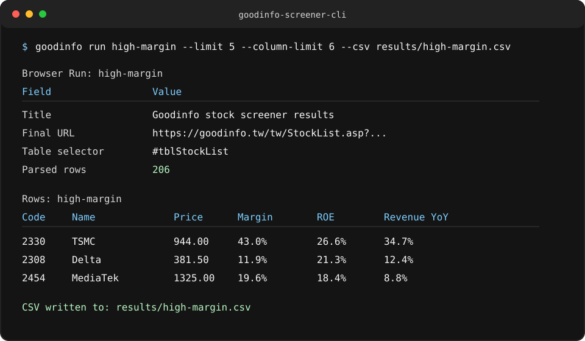

# goodinfo-screener-cli

[](https://github.com/pm7913/goodinfo-screener-cli/actions/workflows/ci.yml)
[](https://github.com/pm7913/goodinfo-screener-cli/actions/workflows/publish.yml)
[](https://pypi.org/project/goodinfo-screener-cli/)
[](https://pypi.org/project/goodinfo-screener-cli/)
[](https://github.com/pm7913/goodinfo-screener-cli/releases)
[](LICENSE)
[](https://github.com/pm7913/goodinfo-screener-cli/issues)

`goodinfo-screener-cli` is a Python CLI for turning a Goodinfo stock screener URL
that you already use manually into a repeatable local workflow.

It saves named screener presets, opens them with a local Playwright browser, waits
for the Goodinfo result table, parses the visible rows, prints a terminal preview,
and can export the same data to CSV or JSON.

This project is intended for low-frequency personal research automation. It does
not provide investment advice, trading recommendations, bulk crawling, login-only
automation, or CAPTCHA bypassing.

## What It Does

- Saves Goodinfo `StockList.asp` screener URLs as named local presets
- Stores presets in `~/.config/goodinfo-screener-cli/presets.yml`
- Runs a saved preset through Chromium with Playwright
- Waits for the stock result table to become available
- Parses rendered table headers and stock rows
- Prints a compact Rich terminal table
- Exports parsed rows to UTF-8 BOM CSV or pretty JSON
- Supports visible browser debugging with `--headful`
- Supports rendered HTML capture with `--html` for parser troubleshooting

## Status

`v0.1.x` is the first MVP release line. The current scope is intentionally narrow:

```text
Save one Goodinfo screener URL, run it locally, parse the rendered table,
preview the result, and export it.
```

See [CHANGELOG.md](CHANGELOG.md) for the release notes and verification summary.
See [docs/project-health.md](docs/project-health.md) for public project metrics,
maintenance activity, roadmap evidence, and the AI-assisted maintenance plan.

## Installation

This project targets Python 3.11 or newer.

Install from PyPI:

```bash
python -m pip install goodinfo-screener-cli
```

Install from a local checkout:

```bash
git clone https://github.com/pm7913/goodinfo-screener-cli.git
cd goodinfo-screener-cli
python3 -m venv .venv
source .venv/bin/activate
python -m pip install -e ".[dev]"
```

Install Playwright's Chromium browser:

```bash
playwright install chromium
```

Verify the CLI:

```bash
goodinfo --help
goodinfo --version
```

## Quick Start

Create the local preset store:

```bash
goodinfo init
```

Save a Goodinfo stock screener URL as a preset:

```bash
goodinfo import high-margin "https://goodinfo.tw/tw/StockList.asp?..."
```

Run the preset and print a readable preview:

```bash
goodinfo run high-margin --limit 10 --column-limit 8
```

Export the parsed rows:

```bash
goodinfo run high-margin \
  --csv results/high-margin.csv \
  --json results/high-margin.json
```

Debug page or parser changes with a visible browser and rendered HTML output:

```bash
goodinfo run high-margin --headful --html fixtures/high-margin.html
```

See [examples/high-margin.yml](examples/high-margin.yml) for a sample preset
based on a cumulative net profit margin screener.

## Demo



The CLI keeps the workflow local and inspectable: save one screener URL, run it
through a browser session you control, review a compact terminal table, and write
CSV or JSON when you need to continue the analysis elsewhere.

## Commands

### `goodinfo init`

Creates the local preset directory and an empty preset file if needed.

Default location:

```text
~/.config/goodinfo-screener-cli/
  presets.yml
```

### `goodinfo import <name> <url>`

Validates and saves a Goodinfo screener URL.

Rules:

- `<name>` must be unique unless `--force` is used
- URL must use `https://goodinfo.tw/`
- URL path must target `/tw/StockList.asp`

Examples:

```bash
goodinfo import high-margin "https://goodinfo.tw/tw/StockList.asp?..."
goodinfo import high-margin "https://goodinfo.tw/tw/StockList.asp?..." --force
```

### `goodinfo list`

Prints saved presets with their name, source, creation time, and URL.

```bash
goodinfo list
```

### `goodinfo run <name>`

Loads a saved preset, opens it in Playwright, parses the rendered Goodinfo table,
prints a terminal preview, and optionally writes export files.

Useful options:

```bash
goodinfo run high-margin
goodinfo run high-margin --headful
goodinfo run high-margin --timeout 45000
goodinfo run high-margin --limit 25 --column-limit 8
goodinfo run high-margin --csv results/high-margin.csv
goodinfo run high-margin --json results/high-margin.json
goodinfo run high-margin --html fixtures/high-margin.html
```

### `goodinfo remove <name>`

Deletes a saved preset from the local preset file.

```bash
goodinfo remove high-margin
```

## Preset Format

Presets are stored locally as YAML:

```yaml
presets:
  high-margin:
    source: goodinfo
    url: "https://goodinfo.tw/tw/StockList.asp?..."
    created_at: "2026-06-01T00:00:00Z"
    browser:
      headless: true
      timeout_ms: 30000
    output:
      format: table
```

The CLI currently creates and reads the preset metadata needed for the MVP
workflow. Extra fields are reserved for future configuration.

## Output

Terminal output uses Rich tables and is designed for quick inspection:

- `--limit <n>` controls how many rows are printed
- `--limit 0` prints all rows
- `--column-limit <n>` controls how many columns are printed
- `--column-limit 0` prints all columns

Exports preserve the first-seen column order from parsed rows:

- `--csv <path>` writes UTF-8 BOM CSV for spreadsheet compatibility
- `--json <path>` writes pretty UTF-8 JSON

## Responsible Use

This tool is designed for transparent, user-controlled, low-frequency personal
research automation.

Expected safeguards:

- Use a real local browser session
- Run one saved screener preset at a time
- Avoid high-frequency requests and bulk crawling
- Do not bypass CAPTCHAs, paywalls, account restrictions, or access controls
- Do not automate login-only workflows
- Do not redistribute proprietary datasets
- Verify market data before relying on it
- Respect Goodinfo's terms, privacy policy, and website availability

This project does not provide investment advice or trading recommendations.
Users are responsible for ensuring their use complies with Goodinfo's terms and
applicable laws.

## Troubleshooting

### Playwright Browser Is Not Installed

If `goodinfo run` fails because Chromium is missing, install it:

```bash
playwright install chromium
```

### Goodinfo Page Loads But Parsing Fails

Goodinfo may change table markup over time. Re-run with rendered HTML output:

```bash
goodinfo run high-margin --html fixtures/high-margin.html
```

Then inspect whether the stock result table still uses `#tblStockList` or a
recognizable stock table structure.

### Terminal Table Is Too Wide

Goodinfo tables can have many columns. Limit the preview:

```bash
goodinfo run high-margin --limit 10 --column-limit 8
```

Use `--column-limit 0` only when your terminal is wide enough.

### Browser Launch Fails On macOS

Headless browser launch can fail in restricted sandbox environments. Try running
from a normal terminal session, or use:

```bash
goodinfo run high-margin --headful
```

## Development

Install development dependencies with the editable install shown above, then run:

```bash
pytest
ruff check .
goodinfo --help
```

The implementation is split into small modules:

- `cli.py` owns command parsing and user-facing errors
- `presets.py` manages local YAML preset storage and validation
- `browser.py` wraps Playwright page loading
- `parser.py` extracts stock rows from rendered Goodinfo HTML
- `exporters.py` renders terminal tables and writes CSV/JSON files

Tests avoid live Goodinfo requests by using synthetic fixtures and focused unit
coverage. Browser smoke tests can be run manually when checking real site
behavior.

See [CONTRIBUTING.md](CONTRIBUTING.md) for the pull request workflow and
responsible-use contribution requirements.

## Roadmap

Near-term follow-up work is tracked in GitHub issues:

- [Support CLI-defined screener filters](https://github.com/pm7913/goodinfo-screener-cli/issues/7)
- [Improve parser resilience for Goodinfo layout changes](https://github.com/pm7913/goodinfo-screener-cli/issues/8)
- [Add optional local caching for recent runs](https://github.com/pm7913/goodinfo-screener-cli/issues/9)
- [Package and release distribution workflow](https://github.com/pm7913/goodinfo-screener-cli/issues/10)

Out of scope for the MVP:

- Building every Goodinfo filter condition from CLI flags
- Running many presets in parallel
- Crawling individual stock detail pages
- Scheduled jobs
- Login-only workflows
- CAPTCHA handling or bypassing
- Hidden API reverse engineering as the default approach
- Investment strategy recommendations

## License

MIT
